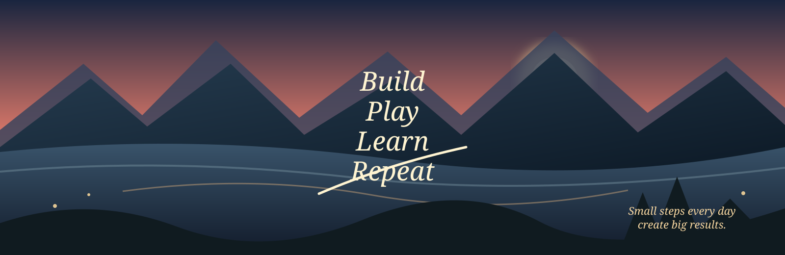

<h1>Hi, I'm Thavon</h1>

  <strong>Game Developer</strong> &nbsp; · &nbsp;
  <strong>3D Artist</strong> &nbsp; · &nbsp;
  <strong>AI Explorer</strong>

Building creative ideas with code, art, and AI.

<table>
<tr>
<td width="28%" valign="top">

## thavon91

Game developer, 3D artist, and technology enthusiast from Laos.

I enjoy turning imaginative ideas into playable worlds, useful tools, and expressive interfaces.

📍 Vientiane, Laos 
🔗 [thavon91.github.io](https://thavon91.github.io)

 

### Focus

🎮 Game systems 
🎨 3D environments 
🌐 Interactive web 
🤖 AI tools

</td>
<td width="72%" valign="top">

## Pinned projects

<table>
<tr>
<td width="50%" valign="top">

### 🎮 [game-prototype](https://github.com/thavon91/game-prototype)

A small game prototype built with Unreal Engine and C++.

`C++` &nbsp; ⭐ 124 &nbsp; 🍴 28

</td>
<td width="50%" valign="top">

### 🌐 [threejs-portfolio](https://github.com/thavon91/threejs-portfolio)

An interactive 3D web portfolio made with Three.js and React.

`JavaScript` &nbsp; ⭐ 66 &nbsp; 🍴 19

</td>
</tr>
<tr>
<td width="50%" valign="top">

### 🤖 [ai-tools](https://github.com/thavon91/ai-tools)

Useful scripts and experiments for AI workflows and automation.

`Python` &nbsp; ⭐ 64 &nbsp; 🍴 12

</td>
<td width="50%" valign="top">

### ⚽ [football-stats](https://github.com/thavon91/football-stats)

Football data, player analysis, and interactive visualizations.

`TypeScript` &nbsp; ⭐ 48 &nbsp; 🍴 10

</td>
</tr>
</table>

</td>
</tr>
</table>

---

## 🧰 Tools I use

`Unreal Engine` &nbsp; `C++` &nbsp; `Blueprint` &nbsp; `Blender` &nbsp; `Three.js` 
`React` &nbsp; `TypeScript` &nbsp; `Node.js` &nbsp; `Python` &nbsp; `LLM` 
`Supabase` &nbsp; `PostgreSQL` &nbsp; `Redis` &nbsp; `WebGPU`

---

## 📊 Activity

---

## 🌱 Currently learning

`Advanced C++` → `Real-Time Rendering` → `Three.js / WebGPU` → `AI + LLM Applications`

### Build · Play · Learn · Repeat

